# ChoreAssistant Design Document

## 1. Architecture Overview

### 1.1 System Architecture

The ChoreAssistant integration follows a layered architecture pattern with clear separation of concerns:

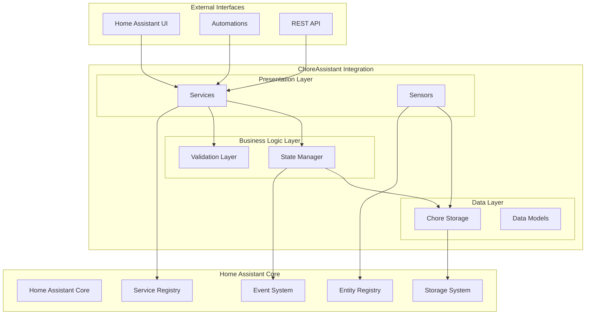

### 1.2 Component Relationships

```mermaid
classDiagram
    class HomeAssistant {
        +data: dict
        +services: ServiceRegistry
        +bus: EventBus
    }
    
    class ChoreAssistantIntegration {
        +async_setup()
        +storage: ChoreStorage
        +state_manager: ChoreStateManager
    }
    
    class ChoreStorage {
        -_hass: HomeAssistant
        -_store: Store
        -_chores: Dict[str, Chore]
        +async_load()
        +async_save()
        +async_add_chore()
        +async_get_chore()
        +async_update_chore()
        +async_remove_chore()
    }
    
    class ChoreStateManager {
        -_storage: ChoreStorage
        -_hass: HomeAssistant
        +transition_state()
        +complete_chore()
        +reset_chore()
        +check_overdue_chores()
    }
    
    class ChoreSensor {
        -_chore: Chore
        -_storage: ChoreStorage
        +state: str
        +extra_state_attributes: dict
        +async_update()
    }
    
    class Chore {
        +id: str
        +name: str
        +state: str
        +due_date: datetime
        +interval_days: int
        +metadata: ChoreMetadata
        +history: List[ChoreHistoryEntry]
        +statistics: ChoreStatistics
    }
    
    HomeAssistant ||--|| ChoreAssistantIntegration
    ChoreAssistantIntegration ||--|| ChoreStorage
    ChoreAssistantIntegration ||--|| ChoreStateManager
    ChoreStorage ||--o{ Chore
    ChoreStateManager ||--|| ChoreStorage
    ChoreSensor ||--|| Chore
    ChoreSensor ||--|| ChoreStorage
```

## 2. Detailed Component Design

### 2.1 Integration Entry Point

**File**: [`__init__.py`](custom_components/chore_assistant/__init__.py:1)

The main integration module handles:
- Component initialization and setup
- Service registration
- Platform loading
- Daily scheduling for overdue checks

```python
async def async_setup(hass: HomeAssistant, config: ConfigType) -> bool:
    """Set up the Chore Assistant component."""
    # Initialize storage and state manager
    # Register services
    # Schedule daily checks
    # Load sensor platform
```

### 2.2 Data Layer

#### 2.2.1 Data Models

**File**: [`models.py`](custom_components/chore_assistant/models.py:1)

Core data structures with serialization support:

```mermaid
classDiagram
    class Chore {
        +id: str
        +name: str
        +state: str
        +created_date: datetime
        +due_date: datetime
        +interval_days: int
        +assigned_to: str
        +metadata: ChoreMetadata
        +history: List[ChoreHistoryEntry]
        +statistics: ChoreStatistics
        +to_dict() dict
        +from_dict(data) Chore
        +add_history_entry()
        +is_overdue() bool
        +get_next_due_date() datetime
    }
    
    class ChoreMetadata {
        +priority: str
        +category: str
        +estimated_duration: int
        +to_dict() dict
        +from_dict(data) ChoreMetadata
    }
    
    class ChoreHistoryEntry {
        +timestamp: datetime
        +action: str
        +previous_state: str
        +new_state: str
        +notes: str
        +to_dict() dict
        +from_dict(data) ChoreHistoryEntry
    }
    
    class ChoreStatistics {
        +total_completions: int
        +average_completion_time: float
        +last_completed: datetime
        +completion_streak: int
        +to_dict() dict
        +from_dict(data) ChoreStatistics
    }
    
    Chore ||--|| ChoreMetadata
    Chore ||--o{ ChoreHistoryEntry
    Chore ||--|| ChoreStatistics
```

#### 2.2.2 Storage Layer

**File**: [`storage.py`](custom_components/chore_assistant/storage.py:1)

Persistent storage with backup capabilities:

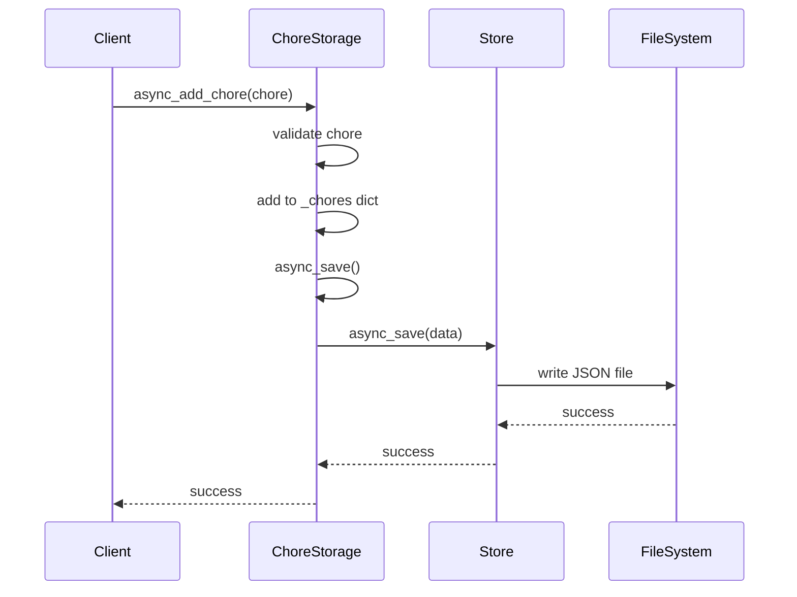

**Key Features**:
- Atomic operations with locking
- Data validation and migration
- Automatic backup creation
- Error recovery mechanisms

### 2.3 Business Logic Layer

#### 2.3.1 State Management

**File**: [`state_manager.py`](custom_components/chore_assistant/state_manager.py:1)

Handles chore state transitions and business rules:

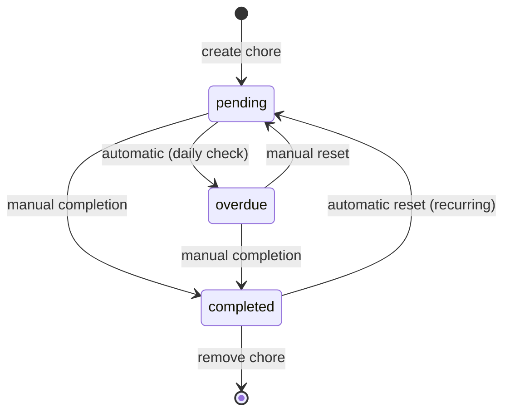

**State Transition Rules**:
- `pending` → `completed`: Manual completion via service
- `pending` → `overdue`: Automatic when past due date
- `overdue` → `completed`: Manual completion via service
- `overdue` → `pending`: Manual reset via service
- `completed` → `pending`: Automatic for recurring chores

#### 2.3.2 Validation Layer

**File**: [`validation.py`](custom_components/chore_assistant/validation.py:1)

Input validation using voluptuous schemas:

```python
# Service validation schemas
ADD_CHORE_SCHEMA = vol.Schema({
    vol.Required(ATTR_CHORE_NAME): validate_chore_name,
    vol.Optional(ATTR_INTERVAL_DAYS, default=7): validate_interval_days,
    vol.Optional(ATTR_DUE_DATE): validate_due_date,
    # ... additional fields
})
```

### 2.4 Presentation Layer

#### 2.4.1 Sensor Platform

**File**: [`sensor.py`](custom_components/chore_assistant/sensor.py:1)

Creates Home Assistant sensor entities for each chore:

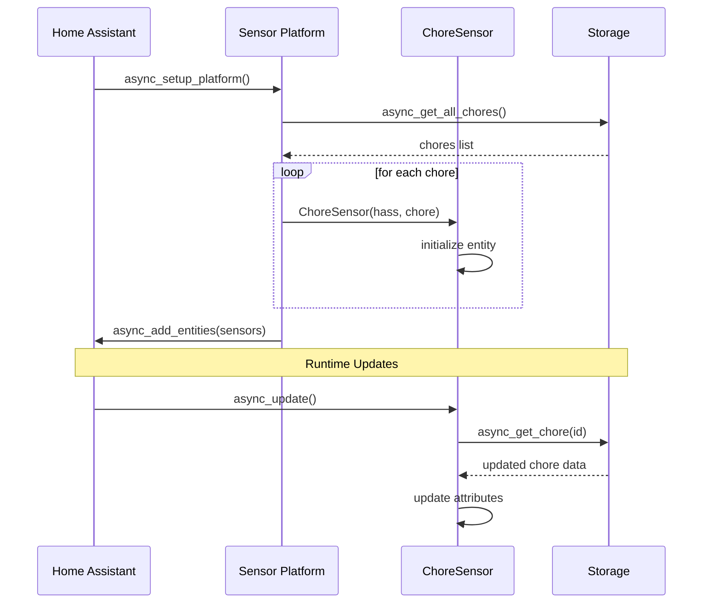

**Sensor Attributes**:
- State: Current chore state
- ID: Unique chore identifier
- Due date: When chore is due
- Assigned to: Person responsible
- Priority: Chore priority level
- Statistics: Completion metrics
- Recent history: Last 5 history entries

#### 2.4.2 Service Layer

**File**: [`services.yaml`](custom_components/chore_assistant/services.yaml:1)

Service definitions with UI integration:

```yaml
add_chore:
  name: Add Chore
  description: Add a new chore to the system
  fields:
    chore_name:
      name: Chore Name
      required: true
      selector:
        text:
```

## 3. Data Flow Architecture

### 3.1 Chore Creation Flow

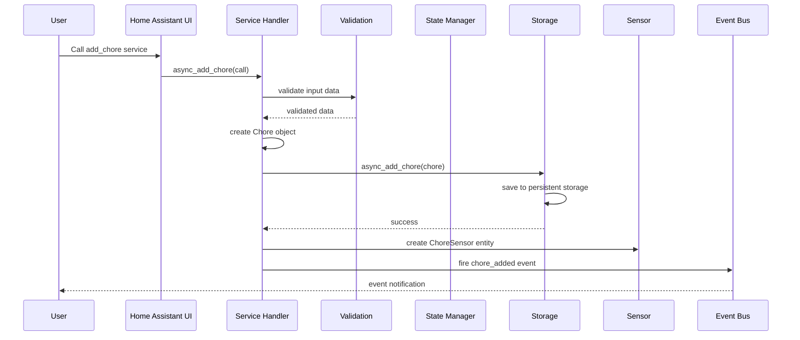

### 3.2 State Transition Flow

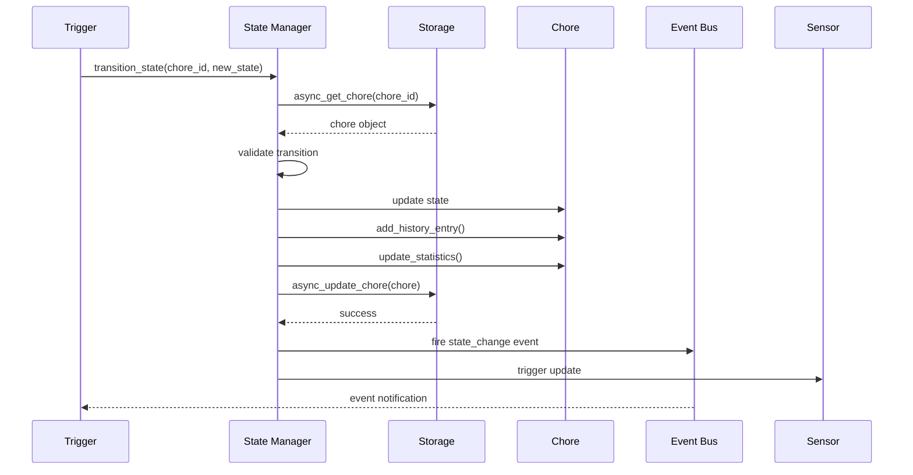

### 3.3 Daily Check Process

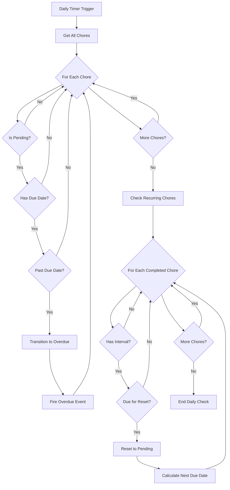

## 4. Database Design

### 4.1 Storage Schema

The integration uses Home Assistant's JSON-based storage system:

```json
{
  "version": 2,
  "metadata": {
    "version": 2,
    "last_updated": "2024-01-01T00:00:00Z"
  },
  "chores": {
    "chore_id": {
      "id": "chore_id",
      "name": "Take out trash",
      "state": "pending",
      "created_date": "2024-01-01T00:00:00Z",
      "due_date": "2024-01-07T00:00:00Z",
      "interval_days": 7,
      "assigned_to": "John",
      "metadata": {
        "priority": "medium",
        "category": "cleaning",
        "estimated_duration": 30
      },
      "history": [
        {
          "timestamp": "2024-01-01T00:00:00Z",
          "action": "created",
          "previous_state": null,
          "new_state": "pending",
          "notes": null
        }
      ],
      "statistics": {
        "total_completions": 0,
        "average_completion_time": null,
        "last_completed": null,
        "completion_streak": 0
      }
    }
  }
}
```

### 4.2 Data Relationships

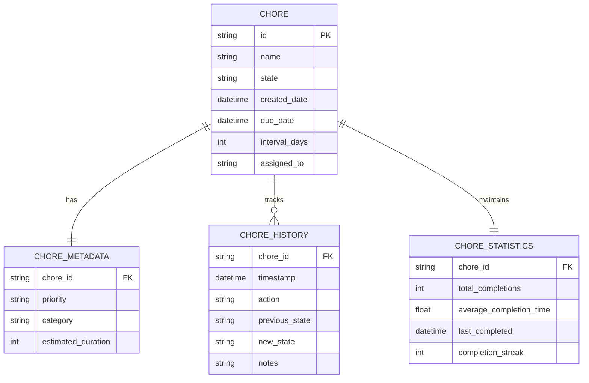

## 5. API Design

### 5.1 Service Interface

#### 5.1.1 Add Chore Service

```yaml
service: chore_assistant.add_chore
data:
  chore_name: "Clean kitchen"
  interval_days: 7
  due_date: "2024-01-07"
  assigned_to: "John"
  priority: "medium"
  category: "cleaning"
  estimated_duration: 45
```

#### 5.1.2 Complete Chore Service

```yaml
service: chore_assistant.complete_chore
data:
  chore_id: "clean_kitchen"
  notes: "Extra thorough cleaning today"
```

#### 5.1.3 Update Chore Service

```yaml
service: chore_assistant.update_chore
data:
  chore_id: "clean_kitchen"
  chore_name: "Deep clean kitchen"
  interval_days: 14
  priority: "high"
```

### 5.2 Event Interface

#### 5.2.1 Chore Completed Event

```yaml
event_type: chore_assistant_chore_completed
event_data:
  chore_id: "clean_kitchen"
  name: "Clean kitchen"
  completed_by: "John"
  timestamp: "2024-01-07T10:30:00Z"
```

#### 5.2.2 Chore Overdue Event

```yaml
event_type: chore_assistant_chore_overdue
event_data:
  chore_id: "clean_kitchen"
  name: "Clean kitchen"
  due_date: "2024-01-07"
  days_overdue: 2
  timestamp: "2024-01-09T00:00:00Z"
```

### 5.3 Sensor Interface

#### 5.3.1 Sensor State

```yaml
entity_id: sensor.chore_assistant_clean_kitchen
state: "pending"
attributes:
  id: "clean_kitchen"
  name: "Clean kitchen"
  created_date: "2024-01-01T00:00:00Z"
  due_date: "2024-01-07T00:00:00Z"
  interval_days: 7
  assigned_to: "John"
  priority: "medium"
  category: "cleaning"
  estimated_duration: 45
  statistics:
    total_completions: 5
    last_completed: "2023-12-31T10:00:00Z"
    completion_streak: 3
  recent_history:
    - timestamp: "2023-12-31T10:00:00Z"
      action: "completed"
      previous_state: "pending"
      new_state: "completed"
```

## 6. Security Design

### 6.1 Security Architecture

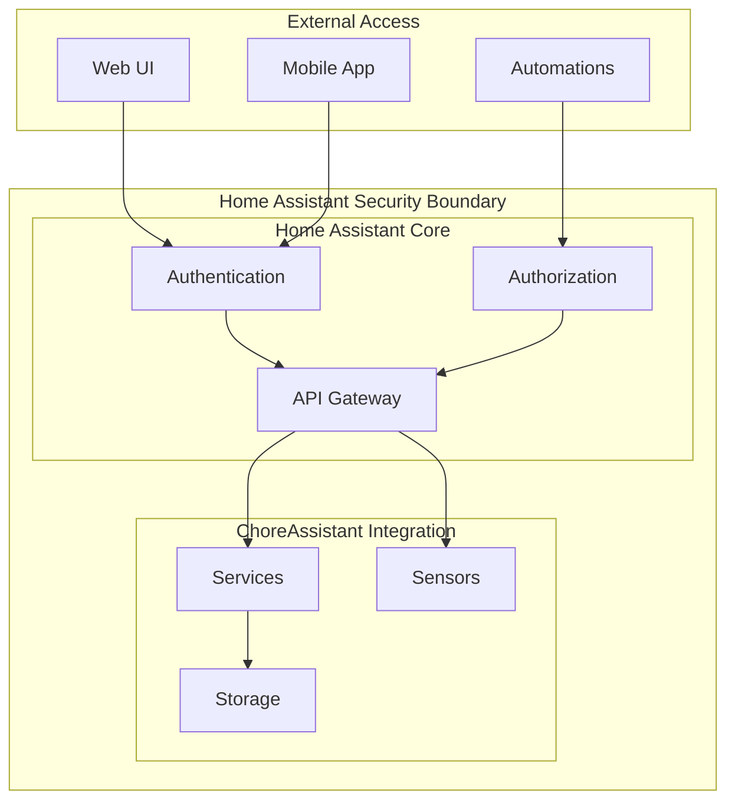

### 6.2 Security Measures

#### 6.2.1 Access Control
- Integration operates within Home Assistant's security model
- No direct external network access
- All operations require Home Assistant authentication
- Service calls subject to Home Assistant authorization

#### 6.2.2 Data Protection
- Local storage only (no cloud dependencies)
- File system permissions protect storage files
- No sensitive personal information stored
- Backup files inherit Home Assistant's security settings

#### 6.2.3 Input Validation
- All service inputs validated using schemas
- SQL injection not applicable (JSON storage)
- Path traversal protection via Home Assistant storage API
- Type checking prevents code injection

## 7. Performance Design

### 7.1 Performance Architecture

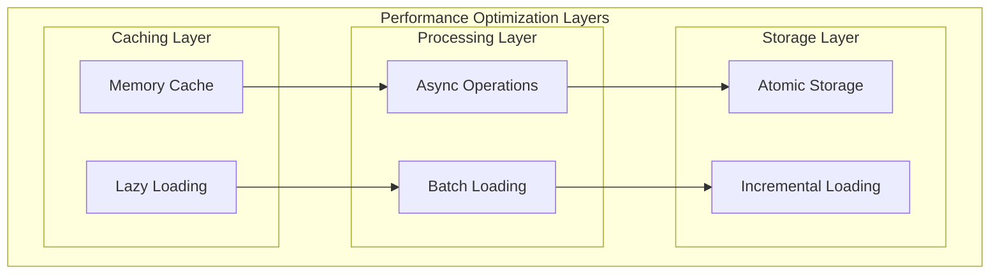

### 7.2 Performance Optimizations

#### 7.2.1 Memory Management
- Lazy loading of chore data
- In-memory caching of frequently accessed chores
- Efficient data structures (dictionaries for O(1) lookup)
- Garbage collection friendly object lifecycle

#### 7.2.2 Storage Optimization
- Atomic write operations to prevent corruption
- Incremental saves (only changed data)
- Compressed JSON storage
- Background backup operations

#### 7.2.3 Async Operations
- All I/O operations are asynchronous
- Non-blocking service calls
- Concurrent chore processing where possible
- Efficient event handling

### 7.3 Scalability Considerations

#### 7.3.1 Data Volume
- Support for up to 1000 chores per instance
- Efficient pagination for large datasets
- History pruning for long-running chores
- Statistics aggregation optimization

#### 7.3.2 Concurrent Access
- Thread-safe storage operations
- Async locks for critical sections
- Event-driven updates to minimize polling
- Efficient sensor update batching

## 8. Error Handling Design

### 8.1 Error Handling Strategy

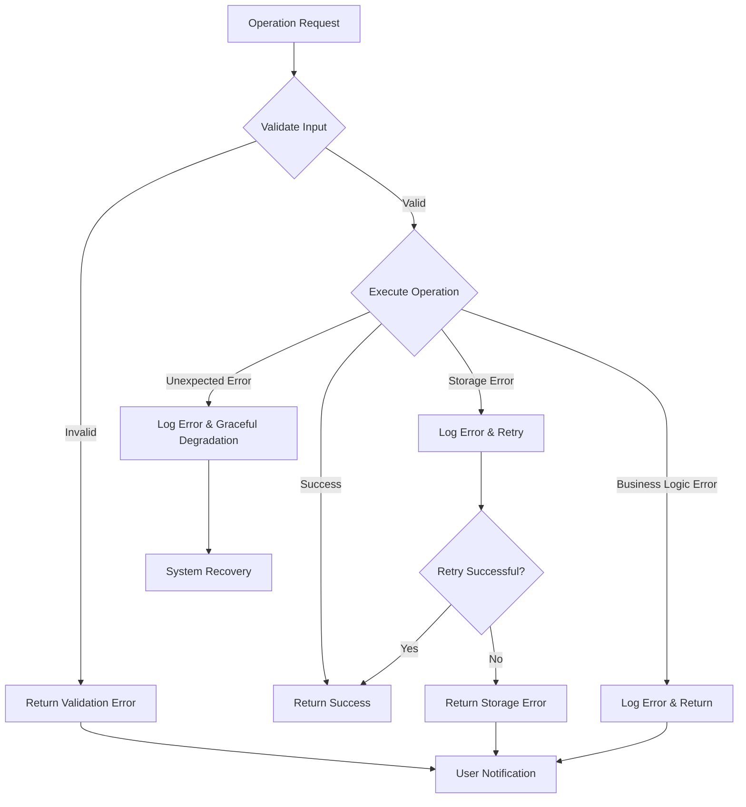

### 8.2 Error Categories

#### 8.2.1 Validation Errors
- Invalid input parameters
- Schema validation failures
- Business rule violations
- State transition errors

#### 8.2.2 Storage Errors
- File system access issues
- Data corruption detection
- Storage quota exceeded
- Concurrent access conflicts

#### 8.2.3 System Errors
- Home Assistant integration failures
- Memory allocation issues
- Network connectivity problems
- Service unavailability

### 8.3 Recovery Mechanisms

#### 8.3.1 Automatic Recovery
- Storage corruption detection and repair
- Automatic backup restoration
- Service restart on critical failures
- Data migration on schema changes

#### 8.3.2 Graceful Degradation
- Continue operation with reduced functionality
- Fallback to cached data when storage unavailable
- Skip problematic chores during batch operations
- Maintain core functionality during partial failures

## 9. Testing Strategy

### 9.1 Testing Architecture

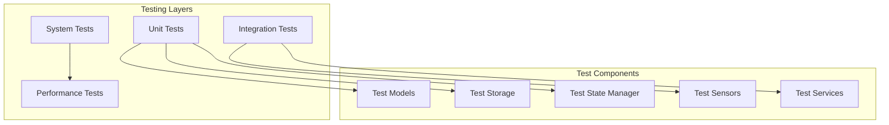

### 9.2 Test Coverage

#### 9.2.1 Unit Tests
- Data model serialization/deserialization
- Storage operations (CRUD)
- State transition logic
- Validation functions
- Statistics calculations

#### 9.2.2 Integration Tests
- Service call handling
- Sensor entity creation and updates
- Event firing and handling
- Storage persistence across restarts
- Error handling scenarios

#### 9.2.3 System Tests
- End-to-end chore lifecycle
- Daily check automation
- Backup and recovery operations
- Performance under load
- Home Assistant integration

## 10. Deployment Design

### 10.1 Deployment Architecture

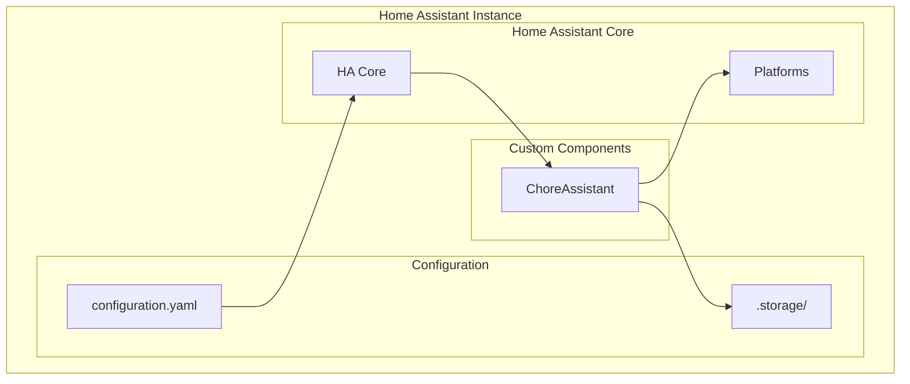

### 10.2 Installation Process

#### 10.2.1 Manual Installation
1. Copy integration files to `custom_components/chore_assistant/`
2. Add `chore_assistant:` to `configuration.yaml`
3. Restart Home Assistant
4. Integration automatically initializes

#### 10.2.2 HACS Installation
1. Add repository to HACS
2. Install via HACS interface
3. Restart Home Assistant
4. Configure via UI or YAML

### 10.3 Configuration Management

#### 10.3.1 Default Configuration
```yaml
# Minimal configuration
chore_assistant:
```

#### 10.3.2 Advanced Configuration
```yaml
# Advanced configuration options
chore_assistant:
  backup_retention_days: 30
  max_history_entries: 100
  daily_check_time: "00:00:00"
```

## 11. Monitoring and Observability

### 11.1 Logging Strategy

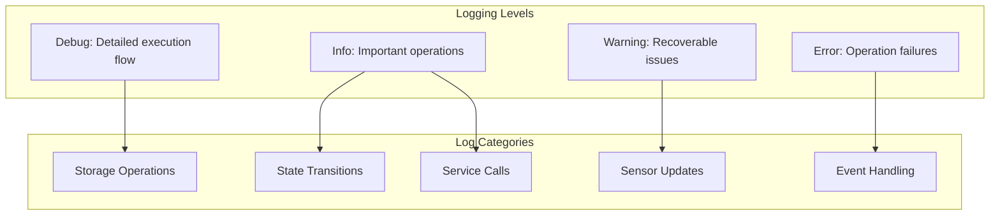

### 11.2 Metrics and Monitoring

#### 11.2.1 Operational Metrics
- Total number of chores
- Active/completed/overdue chore counts
- Service call frequency and success rates
- Storage operation performance
- Error rates by category

#### 11.2.2 Business Metrics
- Chore completion rates
- Average completion times
- Overdue chore trends
- User engagement patterns
- System reliability metrics

### 11.3 Health Checks

#### 11.3.1 System Health
- Storage accessibility
- Service registration status
- Sensor entity availability
- Event system connectivity
- Memory usage monitoring

#### 11.3.2 Data Health
- Storage integrity checks
- Data consistency validation
- Backup system status
- Migration success tracking
- Performance threshold monitoring

## 12. Future Architecture Considerations

### 12.1 Scalability Enhancements

#### 12.1.1 Distributed Architecture
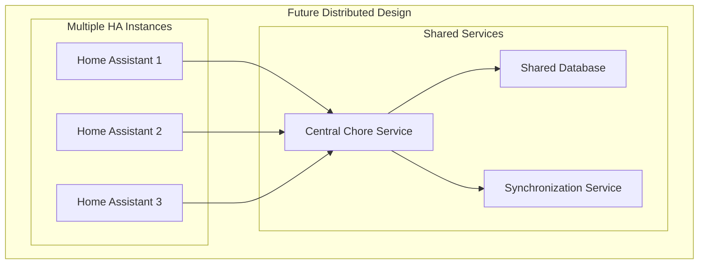

#### 12.1.2 Cloud Integration
- Optional cloud backup
- Multi-instance synchronization
- Mobile app integration
- Calendar system integration

### 12.2 Advanced Features

#### 12.2.1 AI/ML Integration
- Predictive chore scheduling
- Completion time estimation
- Pattern recognition for optimization
- Intelligent reminder timing

#### 12.2.2 Enhanced UI
- Web-based configuration interface
- Visual chore management dashboard
- Advanced reporting and analytics
- Mobile-responsive design

## 13. Conclusion

The ChoreAssistant integration follows a well-structured, modular architecture that provides:

- **Separation of Concerns**: Clear boundaries between data, business logic, and presentation layers
- **Scalability**: Efficient data structures and async operations support growth
- **Reliability**: Comprehensive error handling and recovery mechanisms
- **Maintainability**: Modular design with clear interfaces and documentation
- **Extensibility**: Plugin architecture allows for future enhancements
- **Security**: Operates within Home Assistant's security model
- **Performance**: Optimized for responsive operation under normal loads

This design provides a solid foundation for the current requirements while allowing for future enhancements and scalability improvements.